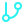
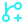
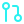

# Icons

<div style="display:inline;">
  
  
  
  
  
  
  
  
  
  
  
  
  
  
  
  
  
  
  
  
  
  
  
  
  
  
  
  
  
  
  
  
  
  
  
  
  
  
  
  
  
  
  
  
  
  
  
  
  
  
  
  
  
  
  
  
  
  
  
  
  
  
  
  
  
  
  
  
  
  
  
  
  
  
  
  
  
  
  
  
  
  
  
  
  
  
  
  
  
  
  
  
  
  
  
  
  
  
  
  
  
  
  
  
  
  
  
<div/>

<details>
  <summary>Listado de nombres</summary>
  
  ```md
  archive-2af1f1.svg
  arrow-down-to-line-2af1f1.svg
  arrow-right-left-2af1f1.svg
  arrow-up-from-line-2af1f1.svg
  book-2af1f1.svg
  braces-2af1f1.svg
  bug-2af1f1.svg
  circle-check-big-2af1f1.svg
  circle-x-2af1f1.svg
  cloud-alert-2af1f1.svg
  cloud-backup-2af1f1.svg
  cloud-check-2af1f1.svg
  cloud-sync-2af1f1.svg
  cloud-upload-2af1f1.svg
  code-2af1f1.svg
  corner-down-left-2af1f1.svg
  corner-down-right-2af1f1.svg
  corner-left-down-2af1f1.svg
  corner-left-up-2af1f1.svg
  corner-right-down-2af1f1.svg
  corner-right-up-2af1f1.svg
  corner-up-left-2af1f1.svg
  corner-up-right-2af1f1.svg
  cpu-2af1f1.svg
  crown-2af1f1.svg
  database-2af1f1.svg
  download-2af1f1.svg
  external-link-2af1f1.svg
  file-archive-2af1f1.svg
  file-text-2af1f1.svg
  fish-symbol-2af1f1.svg
  folder-2af1f1.svg
  folder-archive-2af1f1.svg
  folder-up-2af1f1.svg
  git-branch-2af1f1.svg
  git-branch-minus-2af1f1.svg
  git-branch-plus-2af1f1.svg
  git-commit-horizontal-2af1f1.svg
  git-commit-vertical-2af1f1.svg
  git-fork-2af1f1.svg
  git-pull-request-2af1f1.svg
  github-2af1f1.svg
  hand-heart-2af1f1.svg
  hard-drive-2af1f1.svg
  hard-drive-download-2af1f1.svg
  hard-drive-upload-2af1f1.svg
  history-2af1f1.svg
  info-2af1f1.svg
  instagram-2af1f1.svg
  languages-2af1f1.svg
  link-2af1f1.svg
  linkedin-2af1f1.svg
  list-2af1f1.svg
  list-check-2af1f1.svg
  list-restart-2af1f1.svg
  log-in-2af1f1.svg
  log-out-2af1f1.svg
  message-circle-2af1f1.svg
  message-circle-code-2af1f1.svg
  message-circle-dashed-2af1f1.svg
  message-circle-heart-2af1f1.svg
  message-circle-more-2af1f1.svg
  message-circle-off-2af1f1.svg
  message-circle-plus-2af1f1.svg
  message-circle-question-mark-2af1f1.svg
  message-circle-reply-2af1f1.svg
  message-circle-warning-2af1f1.svg
  message-circle-x-2af1f1.svg
  move-diagonal-2af1f1.svg
  move-down-2af1f1.svg
  move-down-left-2af1f1.svg
  move-down-right-2af1f1.svg
  move-horizontal-2af1f1.svg
  move-left-2af1f1.svg
  move-right-2af1f1.svg
  move-up-2af1f1.svg
  move-up-left-2af1f1.svg
  move-up-right-2af1f1.svg
  move-vertical-2af1f1.svg
  octagon-alert-2af1f1.svg
  octagon-minus-2af1f1.svg
  octagon-pause-2af1f1.svg
  octagon-x-2af1f1.svg
  package-2af1f1.svg
  package-check-2af1f1.svg
  package-minus-2af1f1.svg
  package-plus-2af1f1.svg
  play-2af1f1.svg
  repeat-2af1f1.svg
  rocket-2af1f1.svg
  search-2af1f1.svg
  settings-2af1f1.svg
  shield-alert-2af1f1.svg
  shield-check-2af1f1.svg
  shield-x-2af1f1.svg
  sparkle-2af1f1.svg
  star-2af1f1.svg
  star-north-2af1f1.svg
  tag-2af1f1.svg
  terminal-2af1f1.svg
  test-tube-2af1f1.svg
  text-quote-2af1f1.svg
  triangle-alert-2af1f1.svg
  usb-2af1f1.svg
  users-2af1f1.svg
  webcam-2af1f1.svg
  webhook-2af1f1.svg
  ```
</details>

> URL: `https://raw.githubusercontent.com/capriadev/docs-icons/main/icons/ICON_NAME.svg`